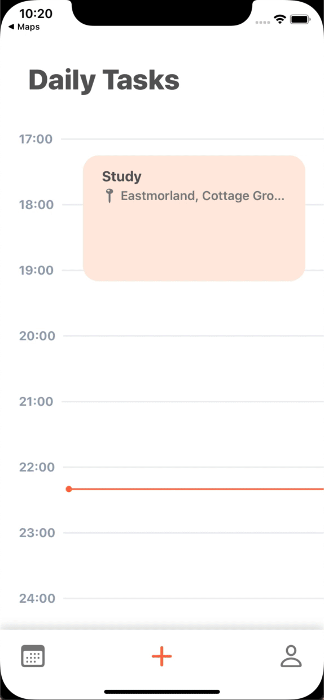

# Calendar
* An iOS platform in Swift 5 to schedule meetings and events and get reminders about upcoming activities
* The UI is created programmatically

## Sign In 
You can sign in to the app via Email

## Add New Event
* You can schedule to get notification

## Show Upcoming Events
* Slide up to expand the list of the upcoming events
* Slide down to minimize the list

## See monthly calendar

## View Event
* Click on location will navigate to that location on map

## Edit Event

## Search Event

## Delete Event

## Built With
* UIKit
* Firebase Real-time Database 
* Core Location

